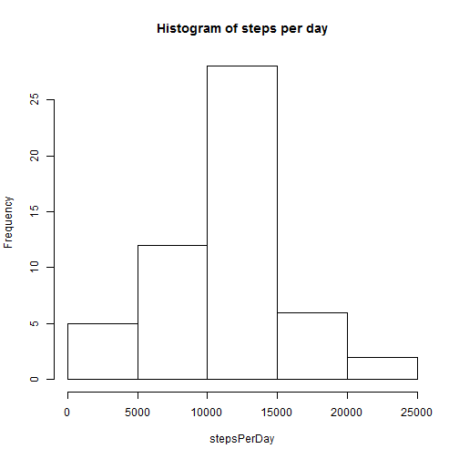

```r
activity<-read.csv("activity.csv")
```


```r
stepsPerDay <- tapply(activity$steps,activity$date,sum)
hist(stepsPerDay, main="Histogram of steps per day")
```

 


Mean steps per day is 1.0766 &times; 10<sup>4</sup>

Median steps per day is 10765


```r
tapply(activity$steps,activity$interval,mean,na.rm=T) -> avgStepsPerInterval
plot(unique(activity$interval), avgStepsPerInterval,
     type="l", main="Steps per 5 minute Interval, averaged across all days")
```

 

The 5-minute interval which has the most steps on average is 104

### Impute missing values

```r
imputedValues<-rep(avgStepsPerInterval, times=sum(is.na(stepsPerDay)));
activity$steps[is.na(activity$steps)] <- imputedValues

stepsPerDay <- tapply(activity$steps,activity$date,sum)
hist(stepsPerDay, main="Histogram of steps per day")
```

 


Mean steps per day is 1.0766 &times; 10<sup>4</sup>

Median steps per day is 1.0766 &times; 10<sup>4</sup>

The mean value is unchanged, but the median value increases by 1.

### Weekdays and Weekends

```r
activity$weekday <- weekdays(as.Date(activity$date))
library(car)
activity$weekday <- recode(activity$weekday, "'Sunday'='Weekend';'Saturday'='Weekend'; else='Weekday'")
activity<-split(activity, activity$weekday)

par(mfrow=c(2,1))
plot(unique(activity$Weekday$interval), tapply(activity$Weekday$steps, activity$Weekday$interval, mean,na.rm=T),
     type="l", main="Steps per 5 minute Interval, averaged across Weekdays")
plot(unique(activity$Weekend$interval), tapply(activity$Weekend$steps, activity$Weekend$interval, mean,na.rm=T),
     type="l", main="Steps per 5 minute Interval, averaged across Weekdays")
```

 
